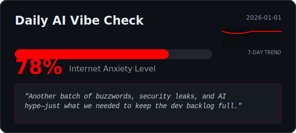

# 🤖 Daily AI Vibe Check

<p align="center">
  
</p>

<p align="center">
  <b>The Internet's mood, analyzed by AI. Updates every 8 hours.</b>
</p>

---

### 🧐 What is this?
This repository is a **self-updating dashboard** that tracks the emotional state of the developer community. 

It's not accurate tho :D but it's fun


Every 8 hours, a GitHub Action wakes up and:
1.  **Scrapes** the top headlines from Hacker News, r/programming, r/ArtificialIntelligence, and Dev.to.
2.  **Feeds** the chaos into a cynical AI.
3.  **Calculates** a "Developer Anxiety Index" (0-100).
4.  **Generates** a snarky commentary and updates the SVG dashboard above.

### 🚀 Add this to your GitHub Profile
Want to show the current state of the dev world on your own profile? Just copy and paste this into your `README.md`:

```markdown
[](https://github.com/BlacKSnowDot0/AI-Vibe-Check)
